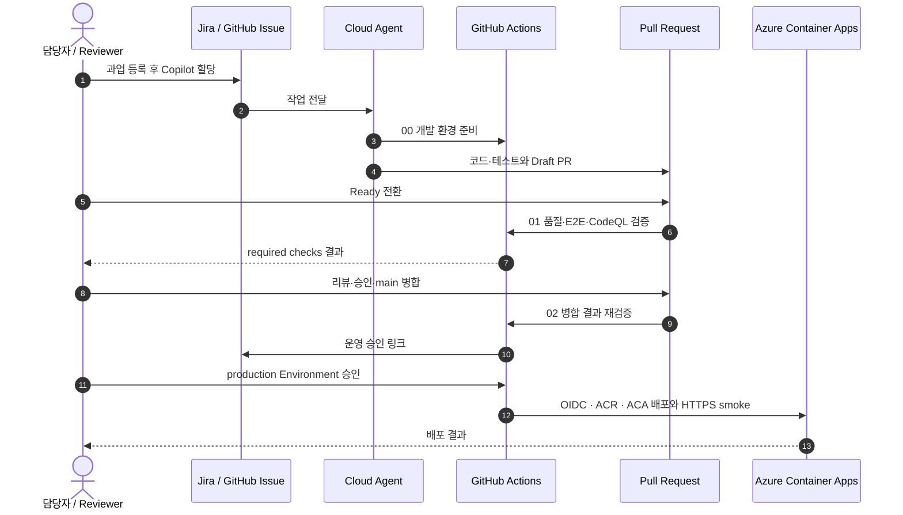
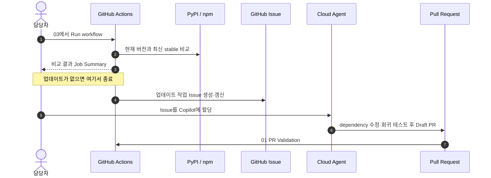
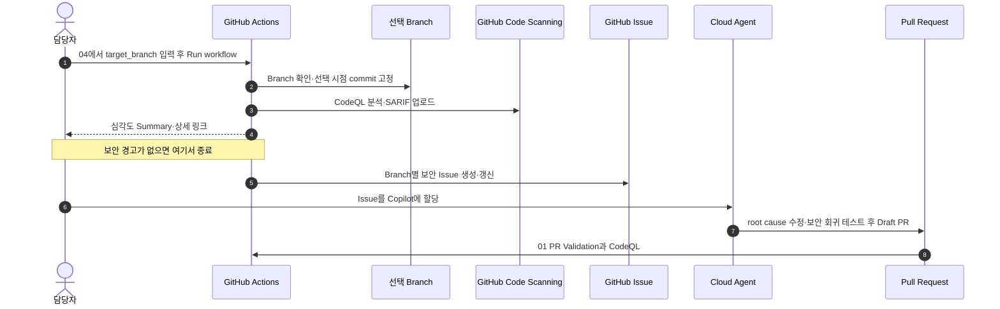
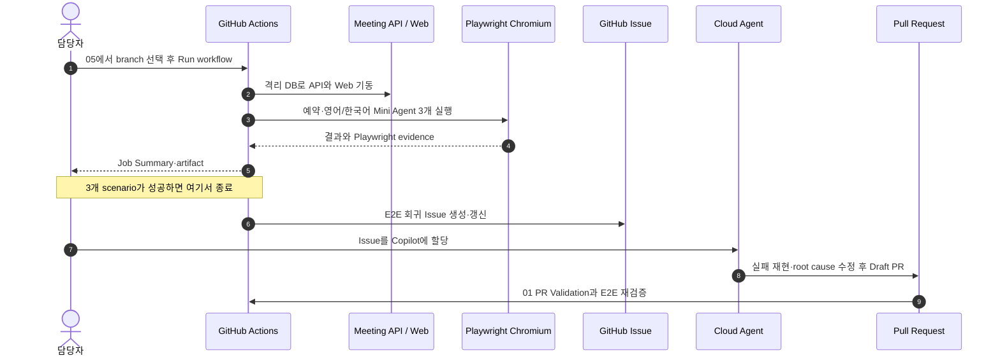

# Cloud Agent + GitHub Actions 기반 Agentic DevOps Demo

GitHub Copilot Cloud Agent가 팀원처럼 개발 과업을 수행하고, GitHub Actions가 과업
발견부터 변경 검증·사람의 승인·운영 배포까지 통제하는 **Agentic DevOps 데모**입니다.
저장소의 회의실·Mini Agent 앱은 이 운영 모델을 끝까지 검증하기 위한 샘플 대상입니다.

| 주체 | Agentic DevOps에서의 역할 |
|---|---|
| 사람 | 과업 선택·Copilot 할당, 기능/보안 리뷰, 병합과 운영 배포 승인 |
| Cloud Agent | 격리된 환경에서 코드·dependency 수정, 테스트, draft PR 생성 |
| GitHub Actions | OSS·보안·E2E 진단, PR 독립 검증, 결과 보고, 승인 gate, 배포 |

핵심 시연 흐름은 다음과 같습니다.

1. Jira 또는 GitHub에서 과업 등록
2. 추적 가능한 GitHub Issue와 Agent-ready 작업 계약 생성
3. GitHub UI/Jira/Slack에서 Copilot cloud agent에 작업 할당
4. Agent가 코드·테스트·PR 작성
5. CI, E2E, CodeQL과 독립 reviewer가 변경 검증
6. `main` 병합 후 재검증하고 별도 운영 승인 뒤 Azure Container Apps 배포
7. OSS·보안·E2E 이상을 수동 진단해 다음 Agent-ready Issue 생성

> Cloud agent는 PR을 자동 승인하거나 병합하지 않습니다. 이 샘플도 모든 자동화의 종착점을 Issue 또는 draft PR로 제한합니다.

## Agentic DevOps Actions 00~05 한눈에 보기

| Action | 핵심 역할 | 결과 |
|---|---|---|
| 00 · Cloud Agent 준비 | 동일한 Python·Node 개발 환경 구성 | Agent 개발·테스트와 Draft PR |
| 01 · PR 검증 | 품질·E2E·CodeQL 독립 검증 | required checks와 검증 근거 |
| 02 · 운영 배포 | 병합 결과 재검증·사람 승인·ACA 배포 | Web·API 배포와 smoke 결과 |
| 03 · OSS 점검 | FastAPI·React 최신 stable 비교 | Summary 또는 업그레이드 Issue |
| 04 · Branch CodeQL | 선택 branch 보안 분석 | Security 결과 또는 보안 Issue |
| 05 · Project E2E | 예약·Mini Agent 브라우저 검증 | Playwright report 또는 회귀 Issue |

## Actions 00~05 상세 흐름

### 00 → 01 → 02 연결 흐름



### 00 · Cloud Agent 재현 환경과 작업 할당

- **시작:** GitHub Issue Assignee, Jira Assignee/댓글 또는 Slack에서 Copilot에 과업 할당
- **Actions:** Python·Node와 프로젝트 의존성을 동일한 조건으로 준비
- **Cloud Agent:** 코드 수정·테스트 후 Draft PR 생성
- **사람:** 계획과 변경 범위를 확인하고 Ready 전환, 후속 작업은 기존 PR의 `@copilot`으로 요청

### 01 · PR Validation — Quality and CodeQL

- **시작:** Draft PR을 사람이 **Ready for review**로 전환
- **PR 1/2:** Python·React·Playwright 품질·E2E 검증
- **PR 2/2:** Python·JavaScript/TypeScript CodeQL 분석
- **결과:** required checks, Job Summary, 실패 artifact
- **재실행:** Ready 이후 commit이 추가되면 PR의 head branch로 수동 실행

### 02 · Production Deployment — Evaluate, Approve, Deploy

- **시작:** PR을 `main`에 병합
- **Main 1/3:** main에 실제 반영된 코드를 기능·E2E로 다시 테스트
- **Main 2/3:** 원본 Issue에 운영 승인 링크 제공
- **Main 3/3:** 사람의 `production` 승인 후 OIDC·ACR·ACA 배포와 HTTPS smoke
- **설정:** `ACA_DEPLOYMENT_ENABLED=true`, 자세한 내용은 [Azure 배포 가이드](docs/azure-container-apps-deployment.md) 참고

`03`~`05`는 담당자가 **Run workflow**로 시작하며, Actions는 진단과 Issue 생성까지만
담당합니다.

### 03 · OSS Upgrade Intake



- **시작:** 담당자가 Run workflow
- **Actions:** FastAPI·React 현재 버전과 registry 최신 stable 비교
- **정상:** Job Summary만 남기고 종료
- **업데이트 발견:** Agent-ready Issue 생성·갱신
- **다음 단계:** 사람이 Copilot에 할당하면 Cloud Agent가 수정 PR 생성

### 04 · Branch CodeQL Remediation



- **시작:** 담당자가 분석할 branch를 입력하고 Run workflow
- **Actions:** 선택 시점의 commit을 고정해 Python·JavaScript/TypeScript CodeQL 실행
- **정상:** 보안 Summary와 Security 상세 링크만 남기고 종료
- **경고 발견:** branch별 Agent-ready 보안 Issue 생성·갱신
- **다음 단계:** 사람이 Copilot에 할당하면 Cloud Agent가 root cause 수정 PR 생성
- **범위:** Dependabot은 GitHub **Security & analysis**의 별도 관리 경로

### 05 · Project E2E



- **시작:** 담당자가 branch를 선택하고 Run workflow
- **Actions:** API·Web을 기동하고 예약·영어/한국어 Mini Agent 3개 시나리오 실행
- **정상:** Job Summary와 Playwright report를 남기고 종료
- **실패:** trace·screenshot·video 업로드 후 Agent-ready E2E Issue 생성·갱신
- **다음 단계:** workflow를 실패 처리하고 사람이 Copilot에 할당해 수정 PR 생성

## 실제 환경 적용 전 변경할 값

- `.github/CODEOWNERS`의 팀·사용자
- Jira/Slack GitHub App의 대상 조직·저장소 범위
- E2E test data와 기대 결과
- ruleset의 required checks와 승인 수
- `production` Environment의 required reviewer와 Azure OIDC federation
- Azure resource group, region, required tags·Policy·quota

## 참고: 샘플 프로젝트 사용 방법

이 샘플 앱은 위 Agentic DevOps 파이프라인을 실행하고 결과를 확인하기 위한 테스트
대상입니다. 브라우저의 **Mini Agent** 화면은 별도 model/API key 없이 실행됩니다.

전체 고객 실습 순서는
[`github-actions-tutorial.html`](github-actions-tutorial.html), Agentic DLC 과업과 평가표는
[`scenarios/agentic-dlc-scenarios.md`](scenarios/agentic-dlc-scenarios.md)를 참고합니다.

### 구성

```text
apps/
  api/                  FastAPI 회의실 예약 API
  web/                  회의실·Mini Agent 테스트 앱
scripts/                OSS·CodeQL·E2E 리포트 helper
tests/                  자동화 스크립트 테스트
scenarios/              고객 실습용 과업·테스트 시나리오
.github/
  agents/               Security/E2E custom agents
  workflows/            CI, CodeQL, E2E, 평가·승인·ACA 배포 workflow
infra/                   ACR·Container Apps·managed identity Bicep
docs/                    Azure OIDC와 production 승인 설정 가이드
```

### Docker Compose로 실행

```bash
docker compose up --build
```

- Web: <http://localhost:5173>
- Meeting API docs: <http://localhost:8000/docs>

### 로컬 프로세스로 실행

```bash
python3 -m venv .venv
source .venv/bin/activate
python -m pip install -e 'apps/api[test]'

uvicorn meeting_api.main:app --app-dir apps/api --reload --port 8000

cd apps/web
npm ci
npm run dev
```

### 테스트

```bash
python -m pytest apps/api/tests tests
cd apps/web
npm ci
npm run lint
npm test
npm run build
npm run test:e2e
```

E2E 최초 실행 전:

```bash
cd apps/web
npx playwright install chromium
```
