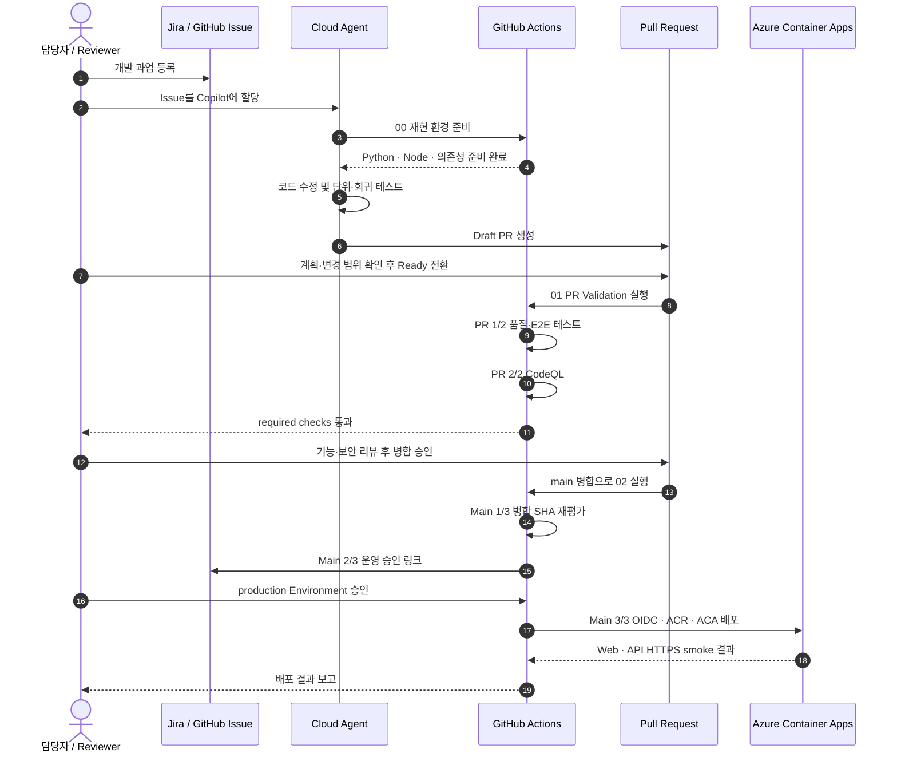
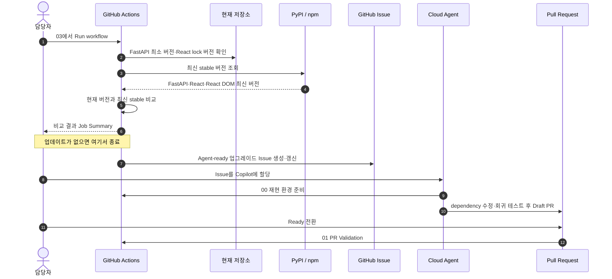
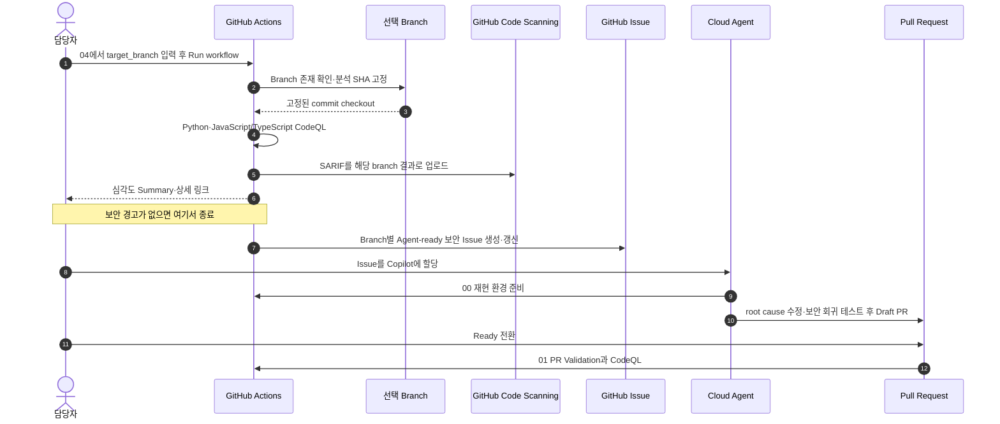
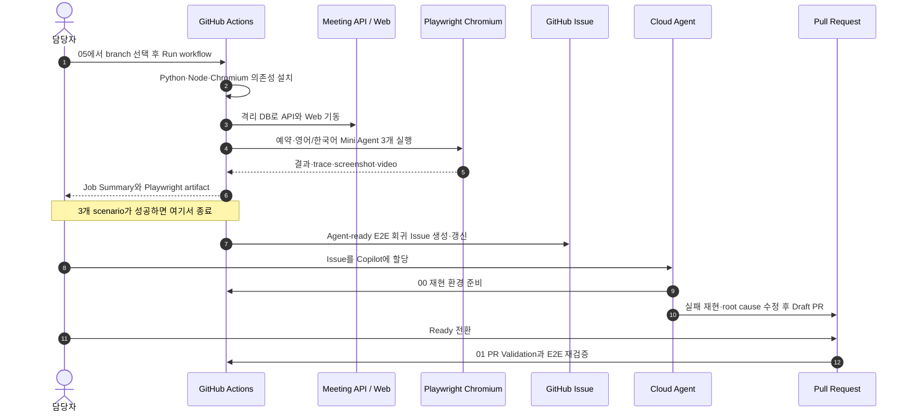

# Cloud Agent + GitHub Actions 기반 Agentic DevOps Demo

GitHub Copilot Cloud Agent가 팀원처럼 개발 과업을 수행하고, GitHub Actions가 과업
발견부터 변경 검증·사람의 승인·운영 배포까지 통제하는 **Agentic DevOps 데모**입니다.
저장소의 회의실·Mini Agent 앱은 이 운영 모델을 끝까지 검증하기 위한 샘플 대상입니다.

| 주체 | Agentic DevOps에서의 역할 |
|---|---|
| 사람 | 과업 선택·Copilot 할당, 기능/보안 리뷰, 병합과 운영 배포 승인 |
| Cloud Agent | 격리된 환경에서 코드·dependency 수정, 테스트, draft PR 생성 |
| GitHub Actions | OSS·보안·E2E 진단, PR 독립 검증, 결과 보고, 승인 gate, 배포 |

핵심 시연 흐름은 다음과 같습니다.

1. Jira 또는 GitHub에서 과업 등록
2. 추적 가능한 GitHub Issue와 Agent-ready 작업 계약 생성
3. GitHub UI/Jira/Slack에서 Copilot cloud agent에 작업 할당
4. Agent가 코드·테스트·PR 작성
5. CI, E2E, CodeQL과 독립 reviewer가 변경 검증
6. OSS·보안·E2E 이상을 수동 진단해 다음 Agent-ready Issue 생성
7. `main` 병합 후 재평가하고 별도 운영 승인 뒤 Azure Container Apps 배포

> Cloud agent는 PR을 자동 승인하거나 병합하지 않습니다. 이 샘플도 모든 자동화의 종착점을 Issue 또는 draft PR로 제한합니다.

## Agentic DevOps 전체 흐름



## Agentic DevOps를 구성하는 Actions 00~05

| 번호 | Workflow | 시작 조건 | 수행 작업 | 결과 |
|---|---|---|---|---|
| 00 | Cloud Agent — Reproducible Setup | Copilot coding agent job | Python·Node·프로젝트 의존성 설치 | Agent가 같은 환경에서 개발·테스트 |
| 01 | PR Validation — Quality and CodeQL | PR을 Ready for review로 전환하거나 수동 실행 | Python·React·Playwright 회귀 테스트 후 CodeQL | required check와 Job Summary, 실패 artifact |
| 02 | Production Deployment — Evaluate, Approve, Deploy | `main` 병합 | 병합 SHA 재평가, production 승인, OIDC 기반 ACA 배포 | 승인 전 대기 또는 Web·API smoke 결과 |
| 03 | Manual — OSS Upgrade Intake | 담당자가 Run workflow 실행 | FastAPI·React/React DOM의 현재 버전과 최신 stable 비교 | 최신 상태 summary 또는 Agent-ready Issue |
| 04 | Manual — Branch CodeQL Remediation | 담당자가 branch를 선택해 Run workflow 실행 | 고정한 branch SHA를 Python·JavaScript/TypeScript CodeQL로 분석 | 보안 summary와 branch별 Agent-ready Issue |
| 05 | Manual — Project E2E | 담당자가 branch를 선택해 Run workflow 실행 | API·Web 기동 후 예약·영어/한국어 Mini Agent Playwright 실행 | HTML report·trace와 실패 시 Agent-ready Issue |

## 샘플 프로젝트 구성

```text
apps/
  api/                  FastAPI 회의실 예약·비식별 품질 지표 API
  web/                  회의실·Mini Agent 테스트 앱
scripts/                OSS·CodeQL·E2E 리포트 helper
tests/                  자동화 스크립트 테스트
scenarios/              고객 실습용 과업·테스트 시나리오
.github/
  agents/               Security/E2E custom agents
  workflows/            CI, CodeQL, E2E, 평가·승인·ACA 배포 workflow
infra/                   ACR·Container Apps·managed identity Bicep
docs/                    Azure OIDC와 production 승인 설정 가이드
```

현재 GitHub Actions 00~05 호출 흐름과 전체 테스트 튜토리얼은
[`github-actions-tutorial.html`](github-actions-tutorial.html)에서 확인합니다.
Agentic DLC 실습과 평가표는
[`scenarios/agentic-dlc-scenarios.md`](scenarios/agentic-dlc-scenarios.md)를 사용합니다.
브라우저의 **Mini Agent** 화면은 별도 model/API key 없이 즉시 실행됩니다.

## 샘플 프로젝트 실행

### Docker Compose

```bash
docker compose up --build
```

- Web: <http://localhost:5173>
- Meeting API docs: <http://localhost:8000/docs>

### 로컬 프로세스

```bash
python3 -m venv .venv
source .venv/bin/activate
python -m pip install -e 'apps/api[test]'

uvicorn meeting_api.main:app --app-dir apps/api --reload --port 8000

cd apps/web
npm ci
npm run dev
```

## 샘플 프로젝트 테스트

```bash
python -m pytest apps/api/tests tests
cd apps/web
npm ci
npm run lint
npm test
npm run build
npm run test:e2e
```

E2E 최초 실행 전:

```bash
cd apps/web
npx playwright install chromium
```

## Cloud Agent 사용

### GitHub Issue

1. `agent-ready` Issue를 생성합니다.
2. Assignee에서 **Copilot**을 선택합니다.
3. Agent session에서 계획·실행 로그를 확인합니다.
4. PR에서 workflow 변경 여부를 검토한 후 필요한 경우 **Approve and run workflows**를 선택합니다.
5. 후속 수정은 기존 PR에 `@copilot` 댓글로 요청합니다.
6. 요청자와 다른 독립 reviewer가 승인한 뒤 병합합니다.

### Jira

실제 Jira용 GitHub Copilot 연동을 설치하면 Jira Assignee 또는 `@GitHub Copilot`
댓글로 직접 Agent 작업을 시작할 수 있습니다. 자세한 순서는 발표 자료의
**실행 튜토리얼**을 참고하세요.

### Slack

GitHub App for Slack을 설치하고 DM 또는 비민감 thread에서 `@GitHub Copilot`을 호출합니다. Slack은 요청·상태 공유, Jira는 업무 추적, GitHub PR은 코드 검토의 기준 채널로 사용합니다.

## 수동 Actions 03~05 실행 흐름

### 03 · OSS Upgrade Intake



03은 버전을 직접 올리지 않습니다. 업데이트가 발견된 경우에만 현재/최신 버전과 완료
조건을 담은 Issue를 만들고, 실제 수정은 사람이 할당한 Cloud Agent가 담당합니다.

### 04 · Branch CodeQL Remediation



04는 입력한 branch가 실제 repository branch인지 먼저 확인하고 그 시점의 SHA를 고정합니다.
따라서 분석 도중 branch가 이동해도 checkout·SARIF·Security 결과가 같은 commit을 가리킵니다.

### 05 · Project E2E



05는 테스트 실패를 retry나 threshold 완화로 숨기지 않습니다. 결과 보고와 artifact 업로드
후 Issue를 만든 다음 workflow 자체도 실패시켜 사람이 조치 필요 상태를 놓치지 않게 합니다.

`03`~`05`는 진단과 Issue 생성까지만 담당합니다. source code 수정, Copilot 할당,
PR 생성, 병합, 배포를 자동으로 수행하지 않으므로 모든 변경에는 사람의 명시적 승인
단계가 남습니다.

| 구간 | Job | 데모 목적 | 실행 시점 |
|---|---|---|---|
| Agent setup | Cloud Agent user-configured setup | Python·Node와 의존성 준비 | Copilot Agent job 내부 |
| PR 1/2 | Quality validation | Python·React·Playwright 실행 요약·artifact | Ready for review PR |
| PR 2/2 | CodeQL security | Python·JavaScript/TypeScript 취약점 분석 | PR 1/2 성공 후 |
| Main 1/3 | Post-merge evaluation | 병합 SHA의 기능·E2E 재평가 | `main` 병합 후 |
| Main 2/3 | Production approval notice | 원본 Issue에 승인 링크 알림 | 재평가 성공 후 |
| Main 3/3 | Production approval and ACA deployment | 승인 후 OIDC·ACR·ACA 배포 | 운영 승인 후 |

Copilot이 만든 Draft/WIP PR에서는 PR Validation job을 실행하지 않습니다.
**Ready for review** 전환 시 PR 1/2~2/2를 순서대로 한 번 수행합니다. Draft에서는
workflow run 자체가 생성되지 않습니다. Ready 이후 commit이 추가되면 Actions에서
`01 · PR Validation`을 열고 **PR의 head branch**를 선택해 수동 실행합니다. CodeQL은
PR 2/2에서 한 번 실행하고 merge 후에는 다시 실행하지 않습니다.

`03`~`05`는 예약 실행이 아니라 Actions의 **Run workflow** 버튼으로만 시작합니다.

일반 Dependabot version-update schedule은 데모 noise를 줄이기 위해 제거했습니다.
Dependabot alerts와 security updates는 repository **Security & analysis** 설정에서
활성화해 신규 취약점에만 사용합니다.
이 설정을 켜면 GitHub가 관리하는 **Dependabot Updates** 항목이 Actions에 별도로
보일 수 있으며, 사용자 정의 데모 workflow가 아니라 Security alert 조치 경로입니다.

## Azure Container Apps 배포

`main` 병합이 곧바로 운영 변경을 만들지는 않습니다.

```text
main merge
  → post-merge unit/integration/E2E evaluation summary
  → ACA_DEPLOYMENT_ENABLED 확인
      ├─ false: 승인 알림·배포를 정상 skip
      └─ true: production Environment required reviewer 대기
  → GitHub OIDC 로그인
  → ACR build + Container Apps revision
  → 테스트 앱 URL과 Web·Meeting API health check 보고
```

배포 후 공개 URL은 테스트 앱 `agentworkflow-web` 하나이며 회의실·예약·Mini Agent
기능을 제공합니다.

`agentworkflow-meeting-api`는 테스트 앱만 호출하는 내부 ACA로 유지합니다.

Azure client secret은 사용하지 않습니다. 실제 subscription·region·resource group과
required reviewer 구성은
[`docs/azure-container-apps-deployment.md`](docs/azure-container-apps-deployment.md)를
따릅니다. 현재 SQLite 데이터는 revision-local인 POC 구성이므로 운영 전에는 managed
database로 전환해야 합니다. Repository variable `ACA_DEPLOYMENT_ENABLED`의 기본값은
비활성이며, `production` 보호와 OIDC 설정을 완료한 뒤에만 `true`로 변경합니다.

배포를 실행하려면 `Settings → Secrets and variables → Actions → Variables`에서
`ACA_DEPLOYMENT_ENABLED=true`로 변경합니다. PR 병합 전 변경했다면 `main` push run이
Main 1/3~3/3을 이어서 실행합니다. 이미 `false` 상태로 병합해 Main 2/3·3/3이
Skipped라면, 값을 `true`로 변경한 뒤 `Actions → 02 · Production Deployment →
Run workflow`에서 `main`을 선택해 다시 실행합니다. 배포 완료 후에는 `false`로
복구합니다.

## 실제 환경 적용 전 변경할 값

- `.github/CODEOWNERS`의 팀·사용자
- Jira/Slack GitHub App의 대상 조직·저장소 범위
- E2E test data와 기대 결과
- ruleset의 required checks와 승인 수
- `production` Environment의 required reviewer와 Azure OIDC federation
- Azure resource group, region, required tags·Policy·quota
